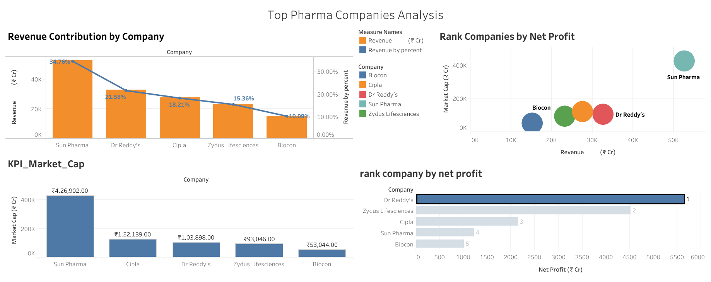

# Indian-Pharma-Financial-Analysis
Financial performance analysis of top Indian pharmaceutical companies using Excel and Tableau.

  

---

## Table of Contents
- [Executive Summary](#executive-summary)
- [Business Problem](#business-problem)
- [Methodology](#methodology)
- [Skills Used](#skills-used)
- [Results and Business Recommendations](#results-and-business-recommendations)
- [Next Steps](#next-steps)
- [Dashboard Preview](#dashboard-preview)

---

## Executive Summary
This project analyzes the financial performance of five leading Indian pharmaceutical companies using publicly available data from Screener.in.

The problem: Investors and analysts struggle to compare pharma companies across key financial metrics in a clear, consolidated way.

The solution: A structured dataset was prepared in Excel, key financial KPIs were generated, and an interactive Tableau dashboard was built to compare:
- Revenue
- Net Profit
- Market Capitalization
- Return on Equity (ROE)
- Debt-to-Equity
- Risk vs Return
- Profit Rankings

Impact: This analysis enables fast benchmarking, easier decision-making, and delivers clear financial storytelling through dashboards.

---

## Business Problem
Pharmaceutical companies differ significantly in scale, profitability, and capital structure. Without a consolidated comparison, it is difficult to identify:
- Which company is most profitable
- Which company delivers the highest investor returns (ROE)
- Which companies operate with high or low debt
- Whether market cap aligns with actual performance
- Which companies dominate the market

### Business Impact
This analysis supports:
- Investors in identifying strong and weak financial performers
- Pharma executives in benchmarking against competitors
- Students and researchers studying industry financials
- Decision-makers evaluating risk and profitability trends

---

## Methodology

### 1. Data Collection
**Source:** Screener.in  
**Companies analyzed:**
- Sun Pharma
- Cipla
- Dr. Reddy’s Laboratories
- Biocon
- Zydus Lifesciences

**Metrics collected:**
Market Cap, Revenue, Net Profit, ROE, Debt-to-Equity.

---

### 2. Excel Work

#### a. Raw Data Sheet
- Created a sheet named "RAW DATA"
- Entered values from Screener.in
- Standardized numerical formatting and column names

#### b. Data Cleaning
- Removed commas and non-numeric characters
- Converted text to numbers
- Ensured consistent decimal formatting
- Verified no missing values

#### c. Financial KPI Calculations
Created a new sheet "FINANCIAL KPIs" with:
- Profit Margin = Net Profit / Revenue
- Revenue-to-Profit Ratio
- Debt Efficiency Score

#### d. Pivot Charts Created in Excel
1. Revenue Comparison Chart  
2. Market Cap vs Net Profit Chart  
3. ROE vs Debt-to-Equity Chart  

These confirmed the dataset was ready for Tableau.

---

### 3. Tableau Analysis

## 6. Tableau Analysis

After preparing and cleaning the dataset in Excel, the final visual analytics and insights were generated in Tableau.  
The dashboard includes multiple interactive charts that together provide a complete financial comparison of the selected pharmaceutical companies.

### **Tableau Visualizations Built**

#### 1. Revenue Contribution by Company (Combo Chart: Bar + Line)
- Bar chart shows absolute revenue for each company  
- Line chart shows each company’s percentage contribution to total revenue  
- Helps compare both scale and relative market presence  
- Insight: Sun Pharma leads with ~35% of the total revenue among the selected companies  

#### 2. Rank Companies by Net Profit (Bubble Scatter Plot)
- A bubble chart where size represents Net Profit  
- X-axis shows Revenue  
- Y-axis shows Market Cap  
- Insight: Sun Pharma stands out with significantly higher profit compared to others  

#### 3. KPI – Market Capitalization (Bar Chart with Labels)
- Direct comparison of Market Cap  
- Used for identifying company valuation strength  
- Insight: Sun Pharma dominates with ₹426,902 Cr Market Cap  

#### 4. Rank Company by Net Profit (Horizontal Bar Ranking Chart)
- Net Profit sorted in descending order  
- Dynamic rank labels shown on each bar  
- Insight:  
  1. Dr. Reddy’s  
  2. Zydus Lifesciences  
  3. Cipla  
  4. Sun Pharma  
  5. Biocon  

#### 5. Clean, Combined Dashboard
The final Tableau dashboard brings all charts together and includes:
- Filters for company selection  
- Custom colors for clarity  
- KPI labels on bars  
- Consistent formatting and fonts  

The dashboard provides a clean, executive-friendly view of:
- Revenue distribution  
- Net profit ranking  
- Market valuation  
- Company performance comparison  

---

## Skills Used
- Excel (cleaning, formulas, pivot tables)
- Tableau (visualization, filters, calculated fields, dashboards)
- Data Analytics (comparative metrics, ranking)
- Financial Understanding (ROE, debt ratios, profit margins)
---

## Results and Business Recommendations

### Key Insights
- Sun Pharma has the highest market cap.
- Dr. Reddy’s has the highest net profit.
- Zydus Lifesciences shows the highest ROE.
- Biocon has high debt and low ROE, indicating higher financial risk.
- Cipla shows stability and very low debt levels.

### Recommendations
- Investors seeking strong returns should focus on Zydus or Dr. Reddy’s.
- Risk-averse investors should be cautious with Biocon.
- Companies can benchmark operational efficiency against Dr. Reddy’s profitability.
- Firms with low ROE should investigate capital efficiency improvements.

---

## Next Steps
- Add multi-year trend analysis
- Include valuation metrics (PE Ratio, ROCE, OPM)
- Expand the dataset to include the top 10 Indian pharma companies
- Add forecasting using Tableau or Python
- Develop a weighted financial scoring model

---

## Dashboard Preview

## Tableau Dashboard  
🔗 **View Interactive Dashboard:**  
https://public.tableau.com/app/profile/anshika.gupta7229/viz/TopIndianPharmaCompaniesRevenueAnalysis/Dashboard1

